# CloudEndure Demo - Moodle

As an AWS Advanced Technology Partner since 2016, CloudEndure has long joined forces with AWS to help customers future-proof their businesses. In January 2019, AWS acquired CloudEndure, expanding our ability to deliver innovative and flexible migration and disaster recovery solutions that are suitable for businesses of all sizes and industries.

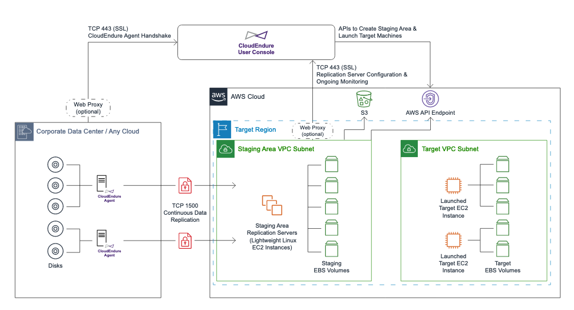

**Key Features of CloudEndure**

- Continuous Block-Level
  Replication
- Cross-Infrastructure Machine Conversion
- Minimal Footprint Staging Area
- Automated Orchestration

This repository demonstrates how to use CloudEndure for migration and disaster recovery. Follow the steps below for each scenario to run the examples.

**Prerequisites**

- AWS account with access to EC2
- EC2 Key Pair created
- For migration, CloudEndure license (Each free CloudEndure Migration license allows for 90 days of use following agent installation). For more information follow the [link](https://aws.amazon.com/cloudendure-migration/pricing/)

_Note: This lab was tested in N.Virginia (us-east-1) and Canada (ca-central-1) regions._

## CloudEndure Migration

CloudEndure Migration simplifies, expedites, and automates large-scale migrations from physical, virtual, and cloud-based infrastructure to AWS. It automatically converts any application running on supported operating systems, enabling full functionality on AWS without compatibility issues. During the replication process, your applications will continue to run at the source without downtime or performance disruption. After a minimal cutover window, your migrated servers will run natively on AWS.

For demonstration, we are going to migrate Amazon EC2 instances between regions (N.Virginia to Canada).

_Note: We are not going deep on replication settings, you can have more details on CloudEndure documentation page. You can find the link at the final of this document._

### Running CloudFormation

This CloudFormation template is going to create the demo environment. It includes AWS IAM credentials for CloudEndure and one EC2 instance with Moodle application at N.Virginia (us-east-1) as source.

_Note: Because of size limits for IAM Policy with CloudFormation we are using Administrator Access Policy for CloudEndure IAM user. In a real scenario you can find the CloudEndure recommended policy at templates/policy.json._

1. Open the CloudFormation console at https://console.aws.amazon.com/cloudformation
2. On the Welcome page click on **Create stack** button
3. On the Step 1 - Specify template: Choose Upload a template file, click on **Choose file** button and select the **template.yaml** located inside templates directory
4. On the Step 2 - Specify stack details: Enter the Stack name as **cloudendure-demo** and also enter your key pair name as parameter
5. On the Step 3 - Configure stack options: Just click on **Next** button
6. On the Step 4 - Review: Enable the checkbox **I acknowledge that AWS CloudFormation might create IAM resources with custom names.**, and click on **Create Stack** button
7. Wait for the stack get into status **CREATE_COMPLETE**
8. Under the Outputs tab, take a note of **Access Key** and **Secret Access Key** value
9. Under the Outputs tab, copy the public ip and past in a new tab. You are going to see a page as follow

   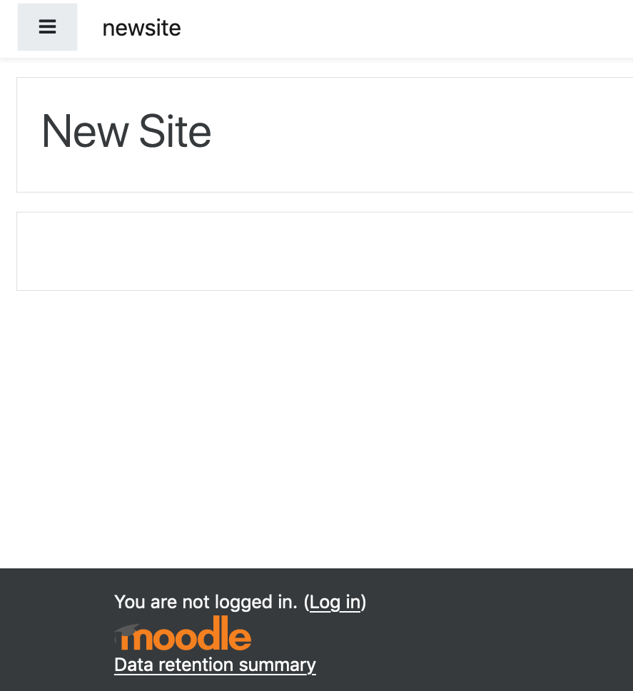

10. To login as admin you need to check the user and password at **System Log**

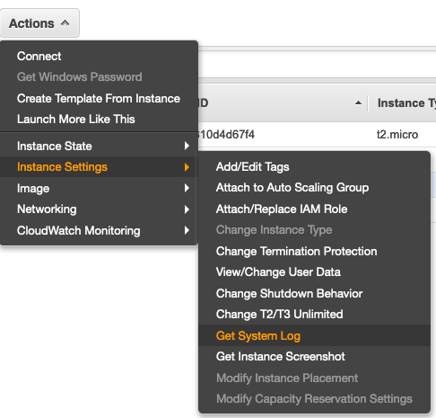

### Creating a new project

Now we are going to setup CloudEndure project.

1. Log-in in your CloudEndure account
2. Click on **+** button to create a new projetct

   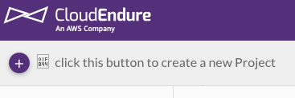

3. For project name specify **demo-migration** and for type select **migration**. After, It is going to generate a new license for you

   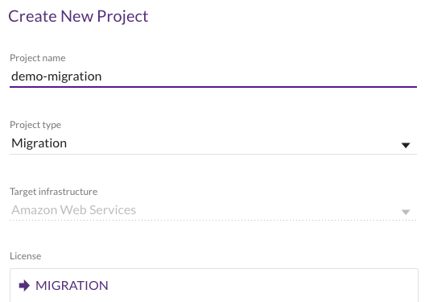

4. Copy the AWS Access Key and Secret Access Key from the CloudFormation stack

   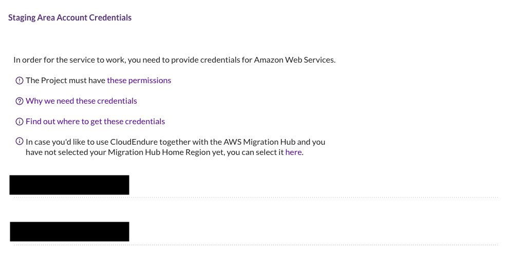

5. Set the replication settings with **AWS US East (Northern Virginia)** as migration source and **AWS Canada (Central)** as migration target and let the settings as default

   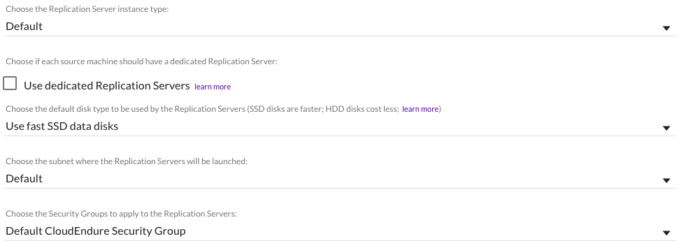

### Installing CloudEndure agent

1. Connect to the source EC2 instance:
   ```
   ssh -i your-key-pair bitnami@public-ip
   ```
2. Donwload the CloudEndure agent installer:
   ```
   wget -O ./installer_linux.py https://console.cloudendure.com/installer_linux.py
   ```
3. Run the installer and follow instructions:
   ```
   sudo python ./installer_linux.py -t your-agent-installation-token --no-prompt
   ```
4. When finished, the instance is going to appear on CloudEndure Console at Machines tab, and the initial replication process will begin

   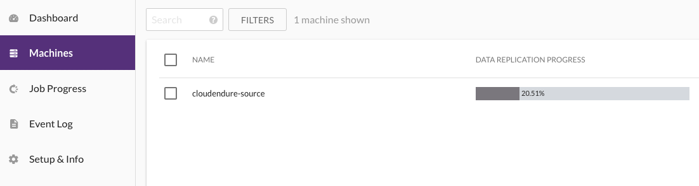

### Running Migration

1. Wait until initial sync is finished (you can check at the CloudEndure console)

   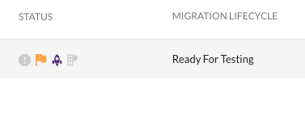

2. Launch a target machine in test mode. You can see the job progress at the **Job Progress** tab

   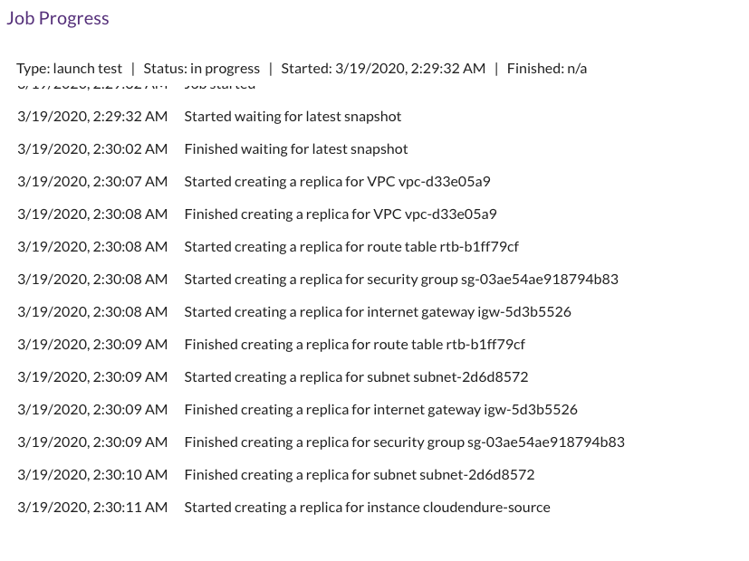

3. Open the Amazon EC2 console to see the destination instance https://console.aws.amazon.com/ec2/. Perform acceptance tests on the machine, once the Target machine is tested successfully, delete it
4. Launch a Target machine in Cutover Mode
5. Confirm that the Target machine was launched successfully. Open the public ip in a new tab to see the same web page from source

   

6. **Congratulations, you finished the migration!** Remove Source machines from the Console after the Cutover has been completed in order to clean up the Staging Area, reduce costs, and remove no longer needed replication resources

## CloudEndure Disaster Recovery

CloudEndure Disaster Recovery and AWS protect against downtime and data loss from any threat, including ransomware and server corruption. Our disaster recovery solution utilizes block-level continuous replication, as well as highly-automated machine conversion and orchestration, to ensure enterprise-grade recovery while reducing traditional disaster recovery expenses.

_Note: You pay for subscription costs per source server registered. Additional taxes or fees may apply. For more information follow the [link](https://aws.amazon.com/cloudendure-disaster-recovery/pricing/)_

### Running CloudFormation

You can use the same CloudFormation template used in the live migration to provision this demo environment. **If you did the previous demo, we recommend deleting the stack created earlier for the live migration demo to not cause conflicts.** This CloudFormation template is going to create the demo environment. It includes AWS IAM credentials for CloudEndure and one EC2 instance with Moodle application at N.Virginia (us-east-1) as source.

_Note: Because of size limits for IAM Policy with CloudFormation we are using Administrator Access Policy for CloudEndure IAM user. In a real scenario you can find the CloudEndure recommended policy at templates/policy.json._

1. Open the CloudFormation console at https://console.aws.amazon.com/cloudformation
2. On the Welcome page, click on **Create stack** button
3. On the Step 1 - Specify template: Choose Upload a template file, click on **Choose file** button and select the **cloudformation.yaml** located inside templates directory
4. On the Step 2 - Specify stack details: Enter the Stack name as **cloudendure-demo** and also enter your key pair name as parameter
5. On the Step 3 - Configure stack options: Just click on **Next** button
6. On the Step 4 - Review: Enable the checkbox **I acknowledge that AWS CloudFormation might create IAM resources with custom names.**, and click on **Create Stack** button
7. Wait for the stack get into status **CREATE_COMPLETE**
8. Under the Outputs tab, take a note of **Access Key** and **Secret Access Key** value
9. Under the Outputs tab, copy the public ip and past in a new tab. You are going to see a page as follow

   

10. To login as admin you need to check the user and password at **System Log**


### Subscribing for CloudEndure Disaster Recovery

To create a disaster recovery project using CloudEndure, it is necessary to subscribe through AWS Marketplace.

1. Access your AWS account through the console and search for AWS Marketplace Subscriptions
2. Click on Manage Subscriptions Button and then Discover products
3. Search for CloudEndure Disaster Recovery
4. Click on ontinue to Subscribe and subscribe it
5. Create a CloudEndure account

### Creating a new project

Now we are going to setup CloudEndure Disaster Recovery project.

1. Log-in in your CloudEndure account at https://www.cloudendure.com/
2. Click on **+** button to create a new projetct

   
   
3. For project name specify **demo-disaster-recovery** and for type select **disaster recovery**. After, It is going to generate a new license for you

   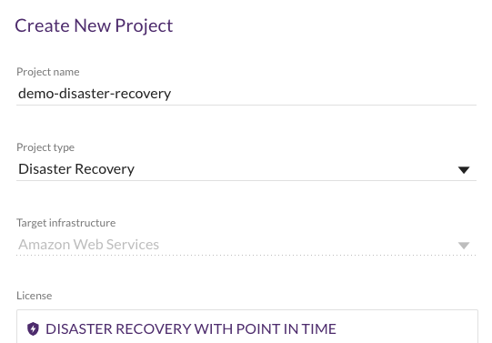

4. Copy the AWS Access Key and Secret Access Key from the CloudFormation stack

   
   
5. Specify where your source machines are located and select your target infrastructure and let the settings as default. In this example, the source is **US East (Northern Virginia)** and the target machine is located on **AWS Canada (Central)**.


### Installing CloudEndure agent

1. Connect to the source EC2 instance:
   ```
   ssh -i your-key-pair bitnami@public-ip
   ```
2. Donwload the CloudEndure agent installer:
   ```
   wget -O ./installer_linux.py https://console.cloudendure.com/installer_linux.py
   ```
3. Run the installer and follow instructions:
   ```
   sudo python ./installer_linux.py -t your-agent-installation-token --no-prompt
   ```
4. When finished, the instance is going to appear on CloudEndure Console at Machines tab, and the initial replication process will begin

   
   
   
### Running Disaster Recovery

1. Wait until initial sync is finished (you can check at the CloudEndure console). Once initial sync is complete, the machines are launchable and will show Continuous Data Protection status in the Data Replication Progress column of the Machines page. 

   
   
2. Configure the target machine blueprint settings

    The last step of the preparation is to define the target machine settings for each source machine on your target machine blueprint. Select your preferred target infrastructure, as well as the other replication settings, such as subnets, security groups, and tags. You can configure the blueprint in the Machines tab of the Blueprint menu at any time during replication, even if the machine has not completed the initial sync.

   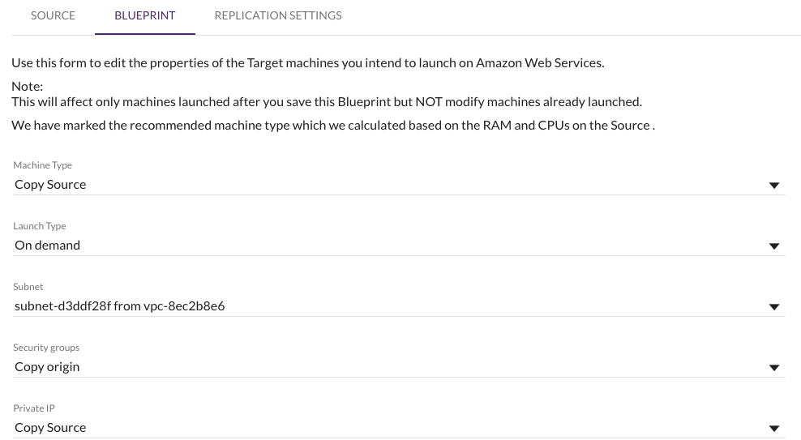

3. Launch a target machine in test mode. 
  
   You also have the option to choose a recovery point to launch the Recovery Plan on the Recovery Point dialog. Choose a Recovery Point and click Continue with Launch.
   
   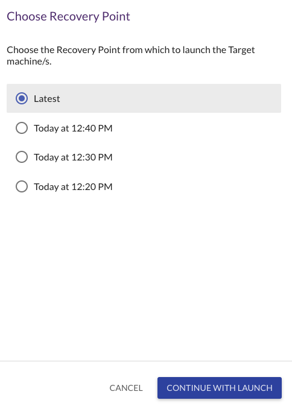


  You can see the job progress at the **Job Progress** tab

   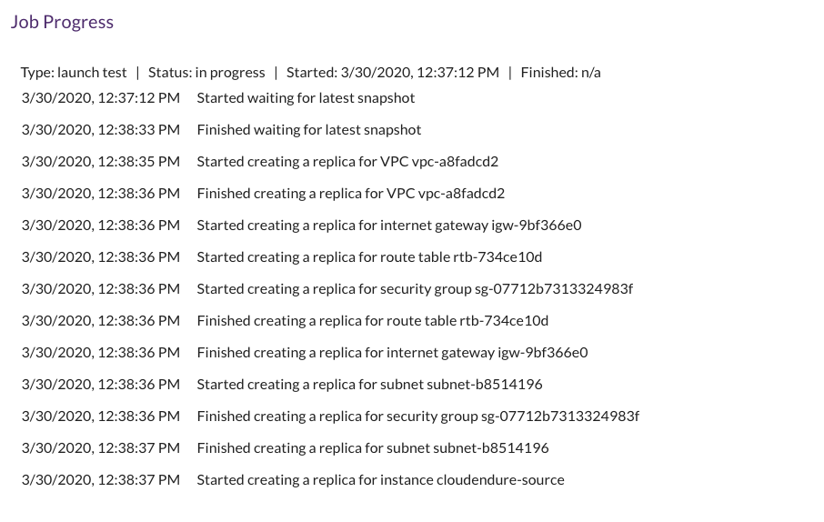

4. Once the target machines are up and running and finished booting, you can run tests on the application to ensure that everything is working correctly. Open the Amazon EC2 console to see the destination instance https://console.aws.amazon.com/ec2/. Perform acceptance tests on the machine, once the Target machine is tested successfully, delete it

5. Conduct failover - Your applications are kept continuously in sync. If there is a disaster, launch your Recovery Plan in Recovery Mode. The functionality of CloudEndure Disaster Recovery is the same when launching machines in Recovery Mode as when launching in Test Mode. However, Test Mode is used for testing and Recovery Mode is used during a disaster.

6. **Congratulations, you finished all the steps!**

   
## References

- CloudEndure page: https://www.cloudendure.com/
- CloudEndure documentation: https://docs.cloudendure.com/
- CloudEndure Migration: https://aws.amazon.com/cloudendure-migration/
- CloudEndure Disaster Recovery: https://aws.amazon.com/cloudendure-disaster-recovery/
- Moodle installation: https://docs.moodle.org/38/en/Step-by-step_Installation_Guide_for_Ubuntu
- Moodle public AMIs: https://bitnami.com/stack/moodle/cloud/aws/amis

## Security

See [CONTRIBUTING](CONTRIBUTING.md#security-issue-notifications) for more information.

## License Summary

This sample code is made available under the MIT-0 license. See the LICENSE file.

Portions copyright.

- Moodle is licensed under the General Public License (GPLv3 or later) from the Free Software Foundation.
